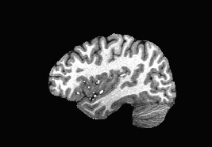
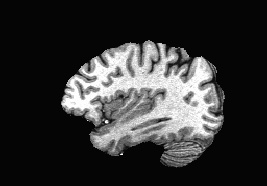
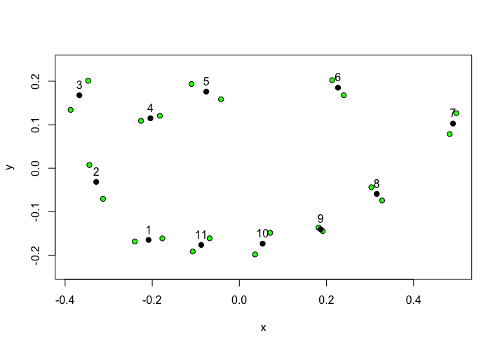

```{r setup, include=FALSE}
knitr::opts_chunk$set(echo = TRUE)
```

```{r, include=FALSE}
library(geomorph)
```


> 1. Choose two images of the same animal and compare a morphological feature through landmarking (at least ten landmark points.

Here, I will be comparing the insular cortices of two people to assess interindividual variability in the size and shape of this patch of cortex. These images are derived from MRI anatomical scans, and I have chosen the same representative 2D slice  (X=38, right insula) in both people. I don't have a proper scale for these images, so I have just estimated for the purpose of this assignment. I just outlined the insula with 11 points around it's area, beginning at the anterior ventral pole and going first superiorly, then posteriorly along the superior edge, then inferiorly, then anteriorly (i.e., in a clockwise manner beginnign at the anterior ventral pole). 

**Subject 1**

{width=50%}


**Subject 2**

{width=50%}


Since the geomorph package works best in an R script versus embedded in an RMarkdown, here is a link to the script for this assignment. 

[Click here for script](Scripts/Adamic_BekahAssignment_Script.R)

The final comparison of the two insulas, shwoing each subject in green and the average between the two in black:




